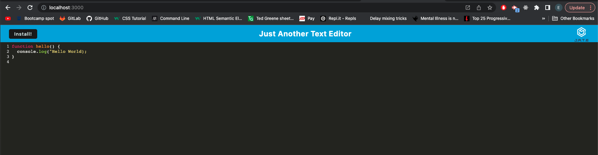
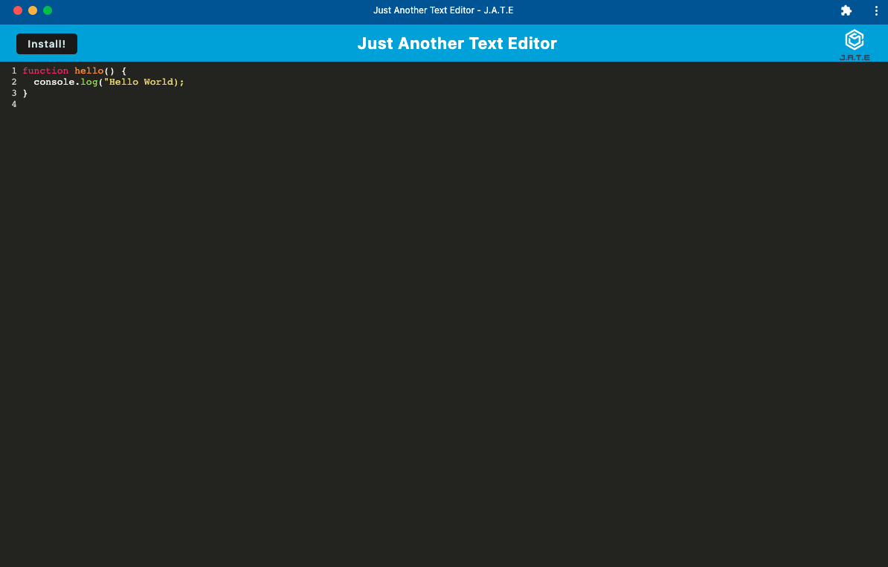

# PWA Text Editor

## Description

This is a Progressive Web Application text editor that runs in the browser and can also be downloaded. 

Following packages are used to build the application:
* Node.js
* Express.js
* Webpack
* Babel
* IndexedDB

## Deployed Application
https://pure-garden-36335.herokuapp.com/

## Installation
`git clone` the repo to your local machine. To use this application, run the following command to install the dependencies: 

     npm install

Then run the following command to start the application:

`npm run start:dev`

## Usage
Type the following command in your termimal:

`npm run start`

Then open your browser and type http://localhost:3000/ to run the application on your local machine.

## Screen Shots

Browser application

Installed application
